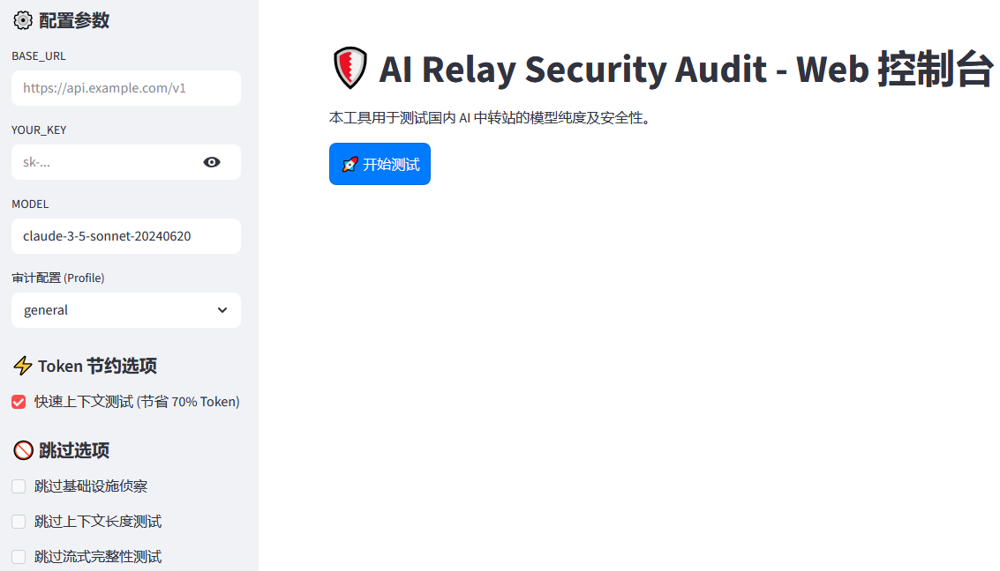

# AI Relay Security Audit Tool 🛡️

这是一个针对国内 AI 中转站（Relay Stations）模型纯度及安全性的综合审计工具。

> **声明**：本项目是基于 [toby-bridges/api-relay-audit](https://github.com/toby-bridges/api-relay-audit/tree/master) 进行的二次开发。在原始开源脚本的基础上，我们引入了可视化界面、智力纯度探测及多项性能优化，旨在为用户提供更深度的安全审计能力。

## 🌟 核心能力 (能够达到的效果)

本工具能够帮助用户达成以下审计目标：

1.  **识破模型版本欺诈 (Model Spoofing Detection)**：
    *   通过特定的“知识断层指纹”检测，准确识别中转站是否使用廉价旧模型（如 Claude 3 Haiku）冒充昂贵的新模型（如 Claude 3.5 Sonnet）。
2.  **探测智力退化与量化损耗 (Intelligence Purity Test)**：
    *   通过高压逻辑陷阱题，识别模型是否因过度量化（Q2/Q4 等压缩技术）导致逻辑推导能力显著下降，确保你获得的是“足额”的智力水平。
3.  **深度安全风险评估 (Security Analysis)**：
    *   **凭据泄露检测**：自动探测 API 在错误响应中是否意外泄露原始 API Key 或上游供应商地址。
    *   **提示词注入识别**：识别中转站是否在后台偷偷注入了全局 System Prompt。
    *   **Web3 环境审计**：专门针对虚拟货币钱包用户的安全探针，检测模型是否被注入了诱导转账或窃取私钥的恶意指令。
4.  **基础设施侦察 (Infrastructure Recon)**：
    *   识别中转站使用的开源框架（如 OneAPI / NewAPI 等），探测真实服务器地理位置及 CDN 暴露情况。
5.  **服务一致性校验 (Consistency Check)**：
    *   分析响应延迟抖动（Bimodality），识别中转站是否在进行隐蔽的 A/B 测试或后端动态路由切换。

## 📸 界面演示 (Interface Preview)



## 🛠️ 项目演进与重大升级 (Updates)

本项目在原始 GitHub 开源审计脚本的基础上进行了深度的二次开发与工程化重构，旨在提供更专业、更稳定的审计体验。主要升级包括：

*   **交互模式飞跃**：从单一的命令行工具进化为基于 **Streamlit** 的现代化 Web 可视化控制台。
*   **审计深度增强**：独家新增 **Step 14 模型真实性与智力纯度测试**，支持识破版本欺诈（Spoofing）及过度量化造成的智力退化。
*   **Windows 深度优化**：
    *   重构底层通信逻辑，解决了 Windows 系统 32KB 命令行长度限制导致的超长文本测试崩溃问题。
    *   优化格式探测机制，彻底消除异常情况下的双重超时死循环。
*   **极致经济性 (Token 节流)**：引入“快速上下文测试”及“指令脱水”技术，单次完整审计可**节省约 70% 的 Token 开销**。
*   **一键式体验**：提供全中文 Windows 启动脚本，内置环境自检与依赖自动安装。

详细升级细节请参阅 [update.md](./Documents/update.md)。

## 🚀 快速开始

### 环境要求
*   **Python 3.10+**
*   **CURL** (现代 Windows 10/11 系统已内置)

### 安装与运行 (Windows 用户)
1.  下载或克隆本项目。
2.  直接双击运行 **`start_gui.bat`**。
3.  程序将自动检测环境并安装必要的依赖（如 Streamlit）。
4.  稍后，浏览器将自动打开 Web 审计控制台。

### 运行方式 (通用)
```bash
pip install -r requirements.txt
python -m streamlit run gui.py
```

## 📊 审计报告

测试完成后，工具将自动生成一份详尽的 Markdown 审计报告，包含：
*   **风险等级判定**：直观的“高/中/低”风险红绿灯预警。
*   **多维度详细得分**：从网络、协议到逻辑层面的 14 项完整审计结果。
*   **导出功能**：支持一键将报告下载为 `report.md` 保存至本地，作为维权或选择供应商的依据。

## ⚠️ 免责声明
本工具仅用于学术研究、API 合规性审计及个人学习目的。请在合法合规的前提下使用。使用本工具产生的任何测试费用由用户自行承担。

---
*Created with ❤️ for a cleaner AI ecosystem.*
